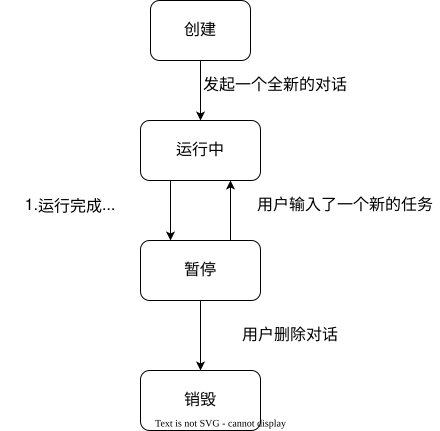

# 会话管理
为什么要引入会话管理？

+ http 本身是无状态的——http 服务需要会话来记录用户的信息
+ AI 模型的无状态——上下文要重放，使用会话来记录上下文

## 生命周期管理
Cline 使用一个 Task 对象来封装 AI 模型的对话。通过该对象来抽象会话的生命周期管理，包括：创建、暂停、恢复、销毁。

## prompt 构建
在发起一次模型调用的时候，决定哪些内容被放到 prompt 中，prompt 中的具体内容是哪些，先后顺序如何？

U 型准则，

### 代码工作区检索 RAG

## 上下文管理
记录和处理模型对话历史，根据当前的对话历史，决定截断历史，并调用模型进行压缩，对话历史在之后的对话依然会被回传。